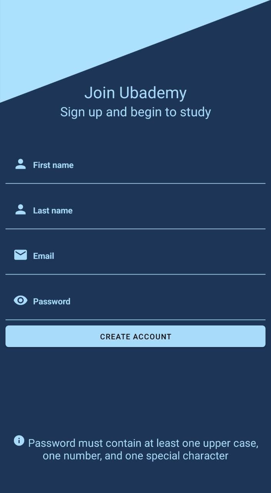
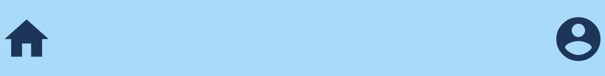
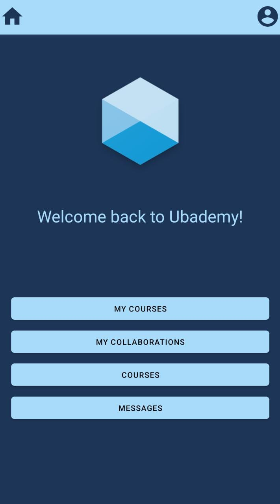
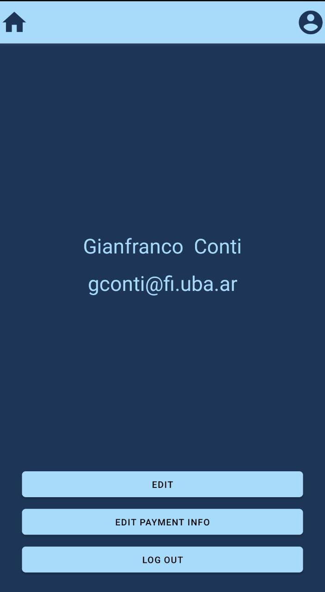

# Index

1. [Getting Started](#GettingStarted)
    1. [Sign In](#SignIn)
    2. [Sign Up](#SignUp)
2. [Usage](#Usage)
    1. [Navigation bar](#Navigationbar)
    2. [Home screen](#Home screen)
    3. [Users screen](#Userscreen)

# <a name="GettingStarted">Getting Started</a>

## <a name="SignIn">Sign In</a>

This is the first page that you will see if this is your first time using the app. In case you don't have an account you
can create one by going to de Sing Up screen by pressing the Sign Up button at the bottom of the screen.

If you already have an account you can Sign In by putting your email and password or by using Google.

## <a name="SignUp">Sign Up</a>

If you don't have an account you can create one by filing up the form. First you fill need to fill your first name, then
your last name, then your email, and last your password(note that your password mas contain at least one upper case ,
one number, and one special character)

   

# <a name="Usage">Usage</a>

## <a name="Navigationbar">Navigation bar</a>

The navigation bar is available in the top of most screens, when available it lets you go both to the home screen by
pressing the home icon and to your user profile by pressing the user icon.

## <a name="HomeScreen">Home Screen</a>

This is the home screen. From here you can go to

1. My courses: where you can see the courses that you created, and create more.
2. My collaborations: where you can see the courses in which you are currently collaborating.
3. Courses: where you can find courses, either by subscription type or by category.
4. Messages: where you can see your active chats.

## <a name="Userscreen">User screen</a>

This is your user screen, this is the info that other users will see. From here you can edit this info by going to Edit,
edit your payment info to become a premium user, or just Log out of the app.

