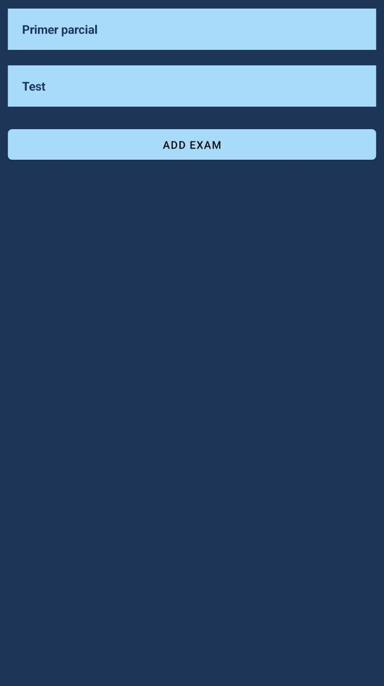

# Index

1. [Getting Started](#GettingStarted)
    1. [Sign In](#SignIn)
    2. [Sign Up](#SignUp)
2. [Usage](#Usage)
    1. [Navigation bar](#Navigationbar)
    2. [Home screen](#HomeScreen)
    3. [Users screen](#Userscreen)
    4. [Edit User Screen](#EditUserScreen)
3. [Courses](#Courses)
    1. [Sections](#Sections)
    2. [My Courses](#MyCourses)
    3. [Create Course](#CreateCourse)
    4. [Administrate Course](#AdministrateCourse)
        1. [Appoint Collaborators](#AppointCollaborators)
        2. [Administrate Section](#AdministrateSection)
        3. [Administrate Resources](#AdministrateResources)
        4. [Administrate Exams](#AdministrateExams)
            1. [Edit Exams](#EditExams)
            2. [Review Exams](#ReviewExams)
4. [Messages](#Messages)
5. [Edit Payment Info](#EditPaymentInfo)

# <a name="GettingStarted">Getting Started</a>

## <a name="SignIn">Sign In</a>

This is the first page that you will see if this is your first time using the app. In case you don't have an account you
can create one by going to de Sing Up screen by pressing the Sign Up button at the bottom of the screen.

If you already have an account you can Sign In by putting your email and password or by using Google.

   

## <a name="SignUp">Sign Up</a>

If you don't have an account you can create one by filing up the form. First you fill need to fill your first name, then
your last name, then your email, and last your password(note that your password mas contain at least one upper case ,
one number, and one special character)

   

# <a name="Usage">Usage</a>

## <a name="Navigationbar">Navigation bar</a>

The navigation bar is available in the top of most screens, when available it lets you go both to the home screen by
pressing the home icon and to your user profile by pressing the user icon.

## <a name="HomeScreen">Home Screen</a>

This is the home screen. From here you can go to

1. My courses: where you can see the courses that you created, and create more.
2. My collaborations: where you can see the courses in which you are currently collaborating.
3. Courses: where you can find courses, either by subscription type or by category.
4. Messages: where you can see your active chats.

## <a name="Userscreen">Users screen</a>

This is your user screen, this is the info that other users will see. From here you can edit this info by going to Edit,
edit your payment info to become a premium user, or just Log out of the app.

If you are at the user screen of another user then you wil be shown their info and at the bottom you will have a button
**Send Message** that brings you to a chat with the user.

## <a name="EditUserScreen">Edit user screen</a>

Here you can change your info, just type the new information and press UPDATE.

# <a name="Courses">Courses</a>

From this screen you can choose if you want to see course by category or by subscription by touching the corresponding
button. From here just press the dropdown menu and chose the type you want to see. Now just select the course you want
to access.

From the course view if your subscription type allows you to enroll to the course an enroll button will show, in case
the course is premium and your account is not there will be a message telling you to upgrade your account. Once you are
enrolled you will be shown three options **View enrolled**, **Sections** to see the course sections, and **cancel** to
cancel your course enrollment.

## <a name="Sections">Sections</a>

From here you will be shown all the sections on the course, and by pressing one you will be shown all the section info.
Form the Section screen you can go to the section **resources**, and **exams**.

From the resources screen you can just press any of the resources for it to be display. From the exams screen you can
choose an exam and if you haven't answered it you will be able to answer and **send it** by pressing the button at the
bottom. If you have already answered the exam your answers will be shown with your score at the bottom in case it's
available.

## <a name="MyCourses">My Courses</a>

Here you will have a list of all the courses that you created you can access any of your courses by touching any of them
or create a new course by pressing the **ADD COURSE** button.

## <a name="CreateCourse">Create Course</a>

To create a course you need to add a **Title**, chose between one of the available **categories**, then chose the
**Subscription Type** if you want your course to be either *free* or *premium*. Finally, add a **description** to your
course so users will understand better what your course is about.

## <a name="AdministrateCourse">Administrate Course</a>

From here you can administrate everything in your course. From here you can **View enrolled** to list all users how are
enrolled to your course, **Edit the course information**, **appoint collaborators** how will be able to administrate the
course, and view the course **sections** and edit them.

### <a name="AppointCollaborators">Appoint Collaborators</a>

Form here you will see all enrolled users at your course, and by touching any of them it will bring you to a screen
where you can make the user a collaborator, or remove them as a collaborator by pressing the button.

### <a name="AdministrateSection">Administrate Section</a>

Once you enter the sections view there will be a list of all your course sections, you can administrate any of them by
touching any of them or create a new section by pressing the add section button.

For the section creation you just define the **Subtitle** for the section and write any information you want to show to
de users in the **Body**.

Form the section you can administrate the **resources** of the section, **Edit** the **Subtitle** and **Body** by going
to **Edit Section**, **Edit the exams** from the section, and **Review** the users exams.

### <a name="AdministrateResources">Administrate Resources</a>

Here you will have a list of all the resources in the section, and you can see them by touching any of them. You can
also add an **image** or a **pdf** by touching the corresponding button.

To add an image or pdf form the corresponding screen touch the **pick** bottom and chose from your phone the file you
want to upload. Once you have chosen se file just pres the **add button** and it will be uploaded.

### <a name="AdministrateExams">Administrate Exams</a>

#### <a name="EditExams">Edit Exams</a>

Here you will se all the exams on the section, you can edit the exam by touching them but only if they are not
published, in which case you will be shown the exam as is. You can create an exam by touching the **Add exam** button.

To create an exam you have to choose a title, and at least one question, you can add more questions by touching the
**Add question** button. Once you are ready just press the upload button.

#### <a name="ReviewExams">Review exams</a>

Here you will be shown all the section exams and by pressing any of them you will be shown all the users attempts. Touch
any fo them to be shown what the user respond and at the end of the exam, you will be able to put any score you want
form 1 to 10. Once you score an exam you can't change it.

# <a name="Messages">Messages</a>

From the **Messages View** you will be shown all your active chats whit other users and by pressing any of them it will
take you to the chat where you can send any text you want.

# <a name="EditPaymentInfo">Edit Payment Info</a>

In this view you will be able to manage your payment info and upgrade your account to premium. First if you don't have a
wallet there will be a message informing you and there will be a button to create your a wallet. Once you have a wallet
you will be able to pay for a month of subscription for 0.001 ETH, if you already are premium then there will be a
message letting you know that your account is premium.

